# diagramas-de-flujo
# Guía de Ejercicios - Diagramas de Flujo

Este repositorio contiene la resolución completa de 20 ejercicios de diagramas de flujo, implementados usando Mermaid.

## Índice de Ejercicios

1. [Mostrar números del 1 al 5](#ejercicio-1)
2. [Número positivo o negativo](#ejercicio-2)
3. [Mayor de dos números](#ejercicio-3)
4. [Tabla de multiplicar](#ejercicio-4)
5. [Mayor o menor de edad](#ejercicio-5)
6. [Operaciones básicas](#ejercicio-6)
7. [Par o impar](#ejercicio-7)
8. [Promedio de notas](#ejercicio-8)
9. [Múltiplo de 3](#ejercicio-9)
10. [Vocal o consonante](#ejercicio-10)
11. [Día de la semana](#ejercicio-11)
12. [Factorial](#ejercicio-12)
13. [Primeros 10 números pares](#ejercicio-13)
14. [Suma de 5 números](#ejercicio-14)
15. [Contar mayores a 100](#ejercicio-15)
16. [Contar números hasta 0](#ejercicio-16)
17. [Promedio con validación](#ejercicio-17)
18. [Contar pares e impares](#ejercicio-18)
19. [Calculadora](#ejercicio-19)
20. [Validar clave](#ejercicio-20)

---

## Ejercicio 1
**Objetivo:** Mostrar los números del 1 al 5.

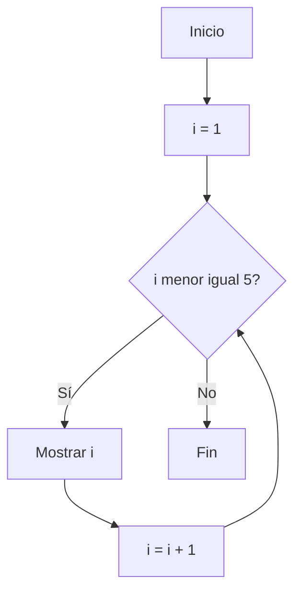
```mermaid
flowchart TD
    A[Inicio] --> B[i = 1]
    B --> C{i menor igual 5?}
    C -->|Sí| D[Mostrar i]
    D --> E[i = i + 1]
    E --> C
    C -->|No| F[Fin]
```

---

## Ejercicio 2
**Objetivo:** Pedir un número y mostrar si es positivo o negativo.

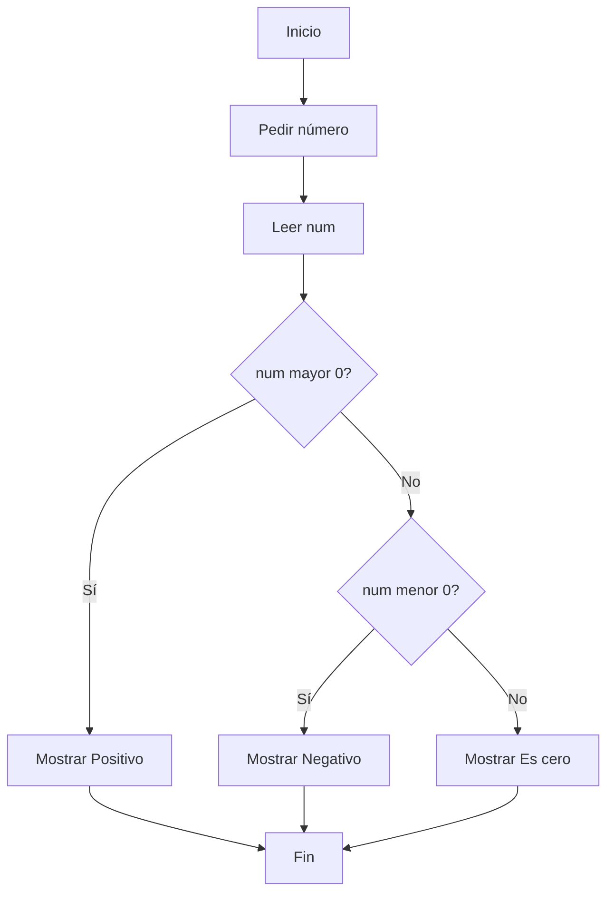
```mermaid
flowchart TD
    A[Inicio] --> B[Pedir número]
    B --> C[Leer num]
    C --> D{num mayor 0?}
    D -->|Sí| E[Mostrar Positivo]
    D -->|No| F{num menor 0?}
    F -->|Sí| G[Mostrar Negativo]
    F -->|No| H[Mostrar Es cero]
    E --> I[Fin]
    G --> I
    H --> I
```

---

## Ejercicio 3
**Objetivo:** Ingresar dos números y mostrar el mayor.

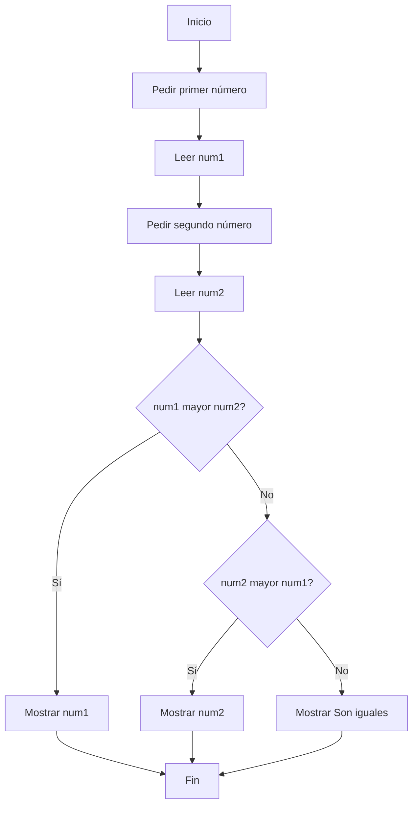
```mermaid
flowchart TD
    A[Inicio] --> B[Pedir primer número]
    B --> C[Leer num1]
    C --> D[Pedir segundo número]
    D --> E[Leer num2]
    E --> F{num1 mayor num2?}
    F -->|Sí| G[Mostrar num1]
    F -->|No| H{num2 mayor num1?}
    H -->|Sí| I[Mostrar num2]
    H -->|No| J[Mostrar Son iguales]
    G --> K[Fin]
    I --> K
    J --> K
```

---

## Ejercicio 4
**Objetivo:** Pedir un número y mostrar su tabla de multiplicar del 1 al 10.

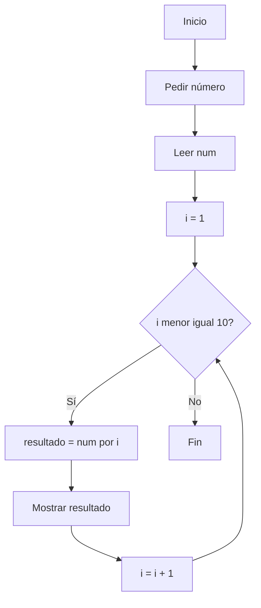
```mermaid
flowchart TD
    A[Inicio] --> B[Pedir número]
    B --> C[Leer num]
    C --> D[i = 1]
    D --> E{i menor igual 10?}
    E -->|Sí| F[resultado = num por i]
    F --> G[Mostrar resultado]
    G --> H[i = i + 1]
    H --> E
    E -->|No| I[Fin]
```

---

## Ejercicio 5
**Objetivo:** Leer una edad e indicar si es mayor o menor de edad.

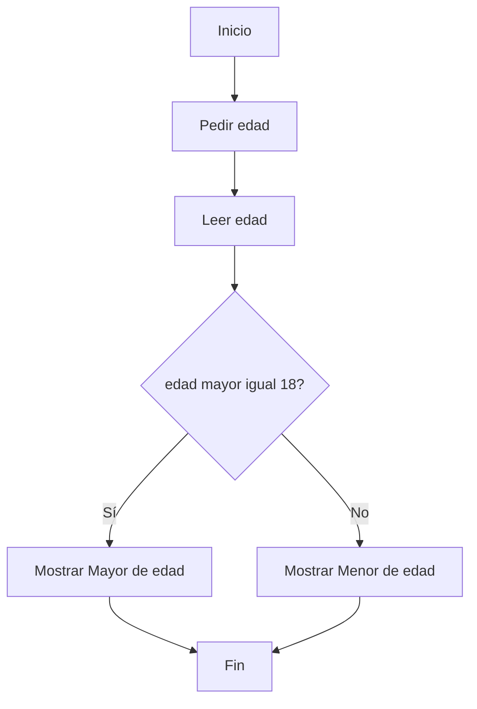
```mermaid
flowchart TD
    A[Inicio] --> B[Pedir edad]
    B --> C[Leer edad]
    C --> D{edad mayor igual 18?}
    D -->|Sí| E[Mostrar Mayor de edad]
    D -->|No| F[Mostrar Menor de edad]
    E --> G[Fin]
    F --> G
```

---

## Ejercicio 6
**Objetivo:** Leer dos números y realizar suma, resta, multiplicación y división.

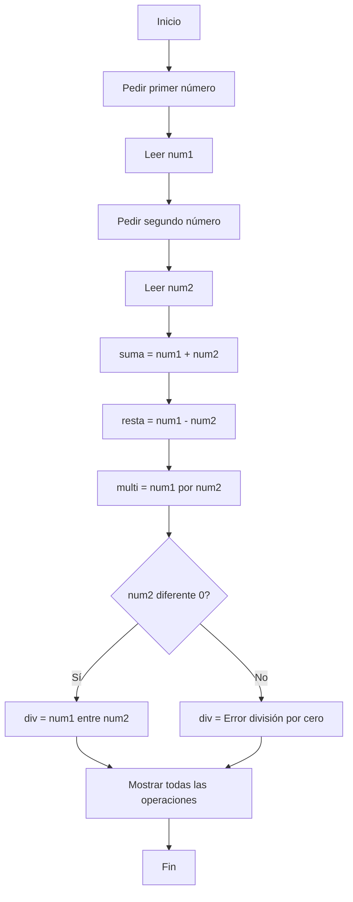
```mermaid
flowchart TD
    A[Inicio] --> B[Pedir primer número]
    B --> C[Leer num1]
    C --> D[Pedir segundo número]
    D --> E[Leer num2]
    E --> F[suma = num1 + num2]
    F --> G[resta = num1 - num2]
    G --> H[multi = num1 por num2]
    H --> I{num2 diferente 0?}
    I -->|Sí| J[div = num1 entre num2]
    I -->|No| K[div = Error división por cero]
    J --> L[Mostrar todas las operaciones]
    K --> L
    L --> M[Fin]
```

---

## Ejercicio 7
**Objetivo:** Leer un número y decir si es par o impar.

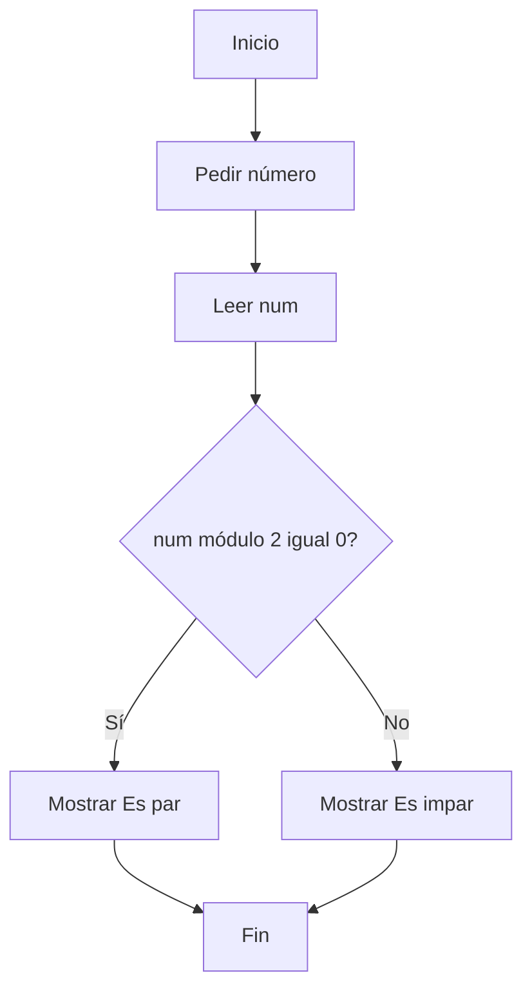
```mermaid
flowchart TD
    A[Inicio] --> B[Pedir número]
    B --> C[Leer num]
    C --> D{num módulo 2 igual 0?}
    D -->|Sí| E[Mostrar Es par]
    D -->|No| F[Mostrar Es impar]
    E --> G[Fin]
    F --> G
```

---

## Ejercicio 8
**Objetivo:** Pedir tres notas, calcular promedio e indicar si está aprobado (promedio ≥ 6).

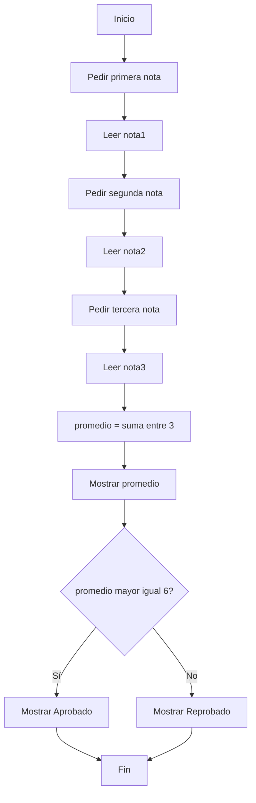
```mermaid
flowchart TD
    A[Inicio] --> B[Pedir primera nota]
    B --> C[Leer nota1]
    C --> D[Pedir segunda nota]
    D --> E[Leer nota2]
    E --> F[Pedir tercera nota]
    F --> G[Leer nota3]
    G --> H[promedio = suma entre 3]
    H --> I[Mostrar promedio]
    I --> J{promedio mayor igual 6?}
    J -->|Sí| K[Mostrar Aprobado]
    J -->|No| L[Mostrar Reprobado]
    K --> M[Fin]
    L --> M
```

---

## Ejercicio 9
**Objetivo:** Leer un número e indicar si es múltiplo de 3.

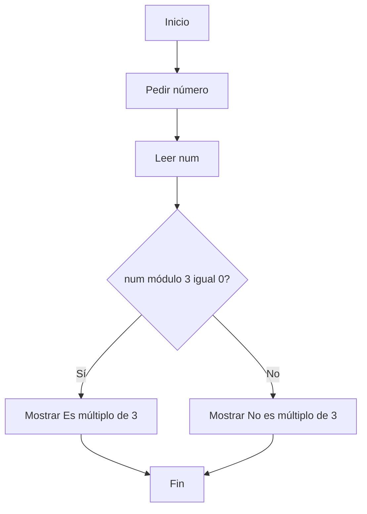
```mermaid
flowchart TD
    A[Inicio] --> B[Pedir número]
    B --> C[Leer num]
    C --> D{num módulo 3 igual 0?}
    D -->|Sí| E[Mostrar Es múltiplo de 3]
    D -->|No| F[Mostrar No es múltiplo de 3]
    E --> G[Fin]
    F --> G
```

---

## Ejercicio 10
**Objetivo:** Pedir una letra e indicar si es vocal o consonante.

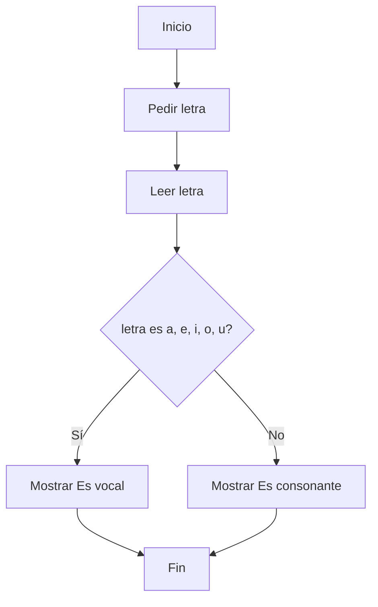
```mermaid
flowchart TD
    A[Inicio] --> B[Pedir letra]
    B --> C[Leer letra]
    C --> D{letra es a, e, i, o, u?}
    D -->|Sí| E[Mostrar Es vocal]
    D -->|No| F[Mostrar Es consonante]
    E --> G[Fin]
    F --> G
```

---

## Ejercicio 11
**Objetivo:** Leer un número del 1 al 7 e imprimir el día de la semana correspondiente.

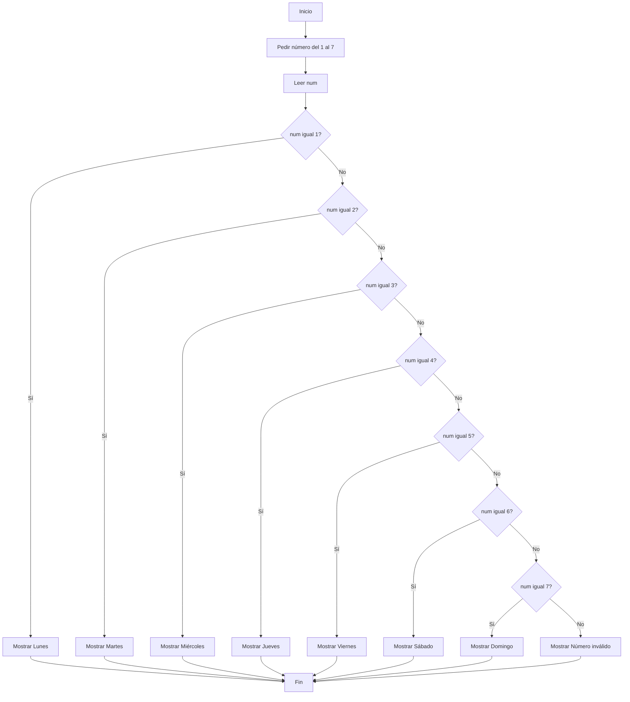
```mermaid
flowchart TD
    A[Inicio] --> B[Pedir número del 1 al 7]
    B --> C[Leer num]
    C --> D{num igual 1?}
    D -->|Sí| E[Mostrar Lunes]
    D -->|No| F{num igual 2?}
    F -->|Sí| G[Mostrar Martes]
    F -->|No| H{num igual 3?}
    H -->|Sí| I[Mostrar Miércoles]
    H -->|No| J{num igual 4?}
    J -->|Sí| K[Mostrar Jueves]
    J -->|No| L{num igual 5?}
    L -->|Sí| M[Mostrar Viernes]
    L -->|No| N{num igual 6?}
    N -->|Sí| O[Mostrar Sábado]
    N -->|No| P{num igual 7?}
    P -->|Sí| Q[Mostrar Domingo]
    P -->|No| R[Mostrar Número inválido]
    E --> S[Fin]
    G --> S
    I --> S
    K --> S
    M --> S
    O --> S
    Q --> S
    R --> S
```

---

## Ejercicio 12
**Objetivo:** Calcular el factorial de un número ingresado.

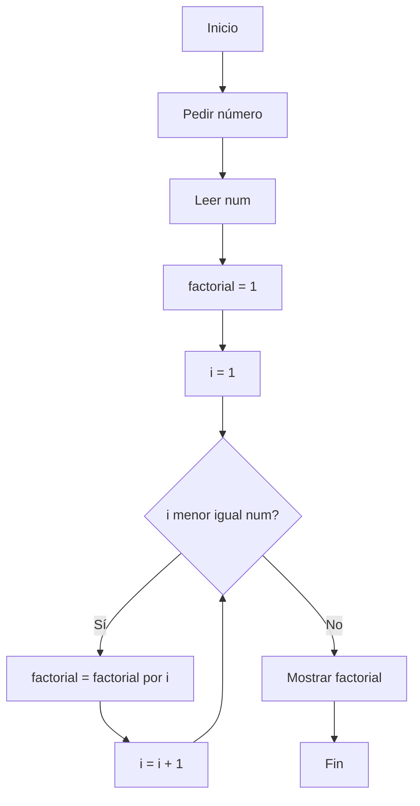
```mermaid
flowchart TD
    A[Inicio] --> B[Pedir número]
    B --> C[Leer num]
    C --> D[factorial = 1]
    D --> E[i = 1]
    E --> F{i menor igual num?}
    F -->|Sí| G[factorial = factorial por i]
    G --> H[i = i + 1]
    H --> F
    F -->|No| I[Mostrar factorial]
    I --> J[Fin]
```

---

## Ejercicio 13
**Objetivo:** Mostrar los primeros 10 números pares.

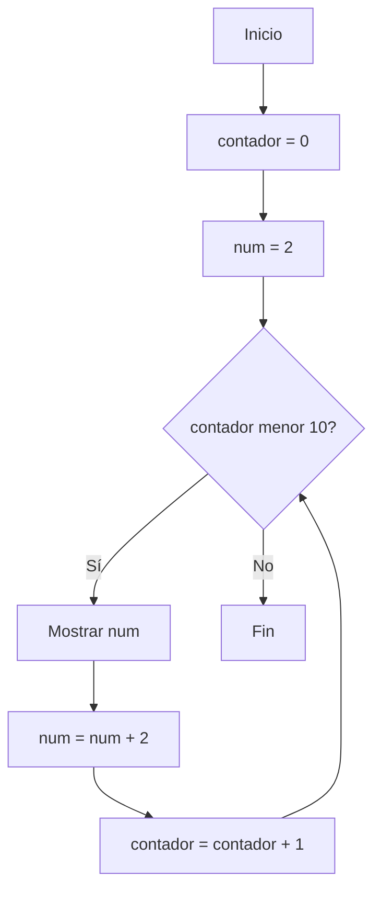
```mermaid
flowchart TD
    A[Inicio] --> B[contador = 0]
    B --> C[num = 2]
    C --> D{contador menor 10?}
    D -->|Sí| E[Mostrar num]
    E --> F[num = num + 2]
    F --> G[contador = contador + 1]
    G --> D
    D -->|No| H[Fin]
```

---

## Ejercicio 14
**Objetivo:** Pedir 5 números y mostrar la suma total.

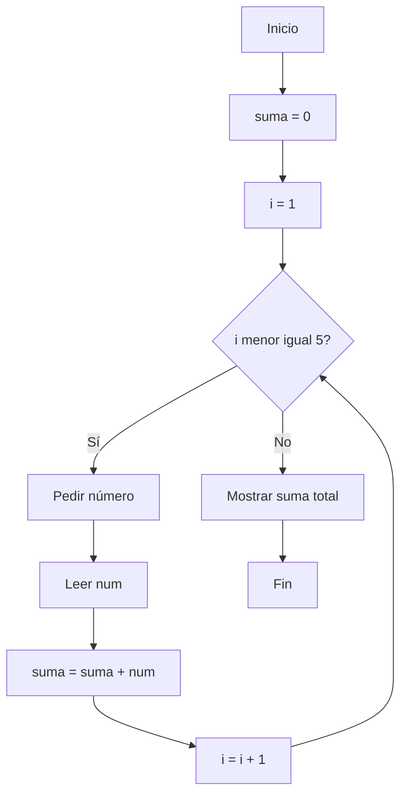
```mermaid
flowchart TD
    A[Inicio] --> B[suma = 0]
    B --> C[i = 1]
    C --> D{i menor igual 5?}
    D -->|Sí| E[Pedir número]
    E --> F[Leer num]
    F --> G[suma = suma + num]
    G --> H[i = i + 1]
    H --> D
    D -->|No| I[Mostrar suma total]
    I --> J[Fin]
```

---

## Ejercicio 15
**Objetivo:** Contar cuántos de los 10 números ingresados son mayores a 100.

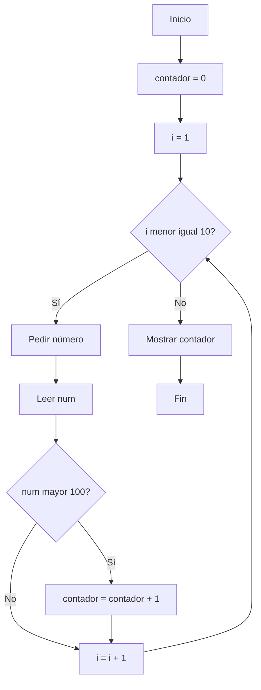
```mermaid
flowchart TD
    A[Inicio] --> B[contador = 0]
    B --> C[i = 1]
    C --> D{i menor igual 10?}
    D -->|Sí| E[Pedir número]
    E --> F[Leer num]
    F --> G{num mayor 100?}
    G -->|Sí| H[contador = contador + 1]
    G -->|No| I[i = i + 1]
    H --> I
    I --> D
    D -->|No| J[Mostrar contador]
    J --> K[Fin]
```

---

## Ejercicio 16
**Objetivo:** Solicitar números hasta ingresar un 0, luego mostrar cuántos se ingresaron en total.

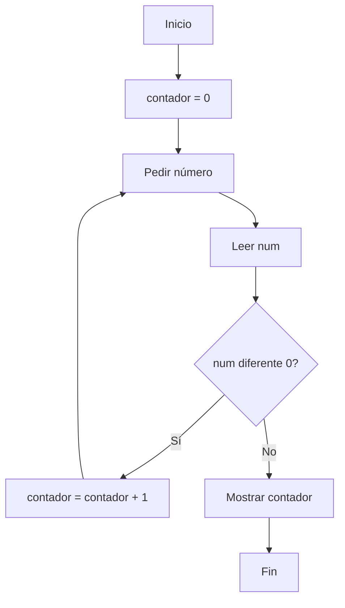
```mermaid
flowchart TD
    A[Inicio] --> B[contador = 0]
    B --> C[Pedir número]
    C --> D[Leer num]
    D --> E{num diferente 0?}
    E -->|Sí| F[contador = contador + 1]
    F --> C
    E -->|No| G[Mostrar contador]
    G --> H[Fin]
```

---

## Ejercicio 17
**Objetivo:** Pedir una cantidad de notas y calcular el promedio general con validación (0-10).

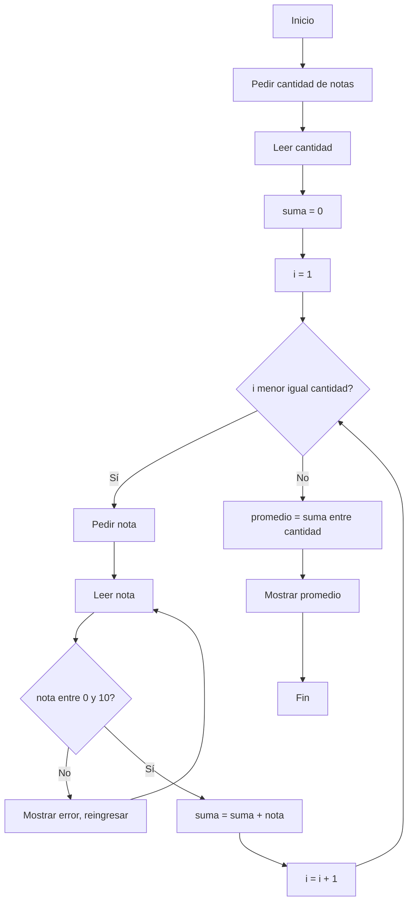
```mermaid
flowchart TD
    A[Inicio] --> B[Pedir cantidad de notas]
    B --> C[Leer cantidad]
    C --> D[suma = 0]
    D --> E[i = 1]
    E --> F{i menor igual cantidad?}
    F -->|Sí| G[Pedir nota]
    G --> H[Leer nota]
    H --> I{nota entre 0 y 10?}
    I -->|No| J[Mostrar error, reingresar]
    J --> H
    I -->|Sí| K[suma = suma + nota]
    K --> L[i = i + 1]
    L --> F
    F -->|No| M[promedio = suma entre cantidad]
    M --> N[Mostrar promedio]
    N --> O[Fin]
```

---

## Ejercicio 18
**Objetivo:** Leer 10 números e imprimir cuántos son pares y cuántos impares.

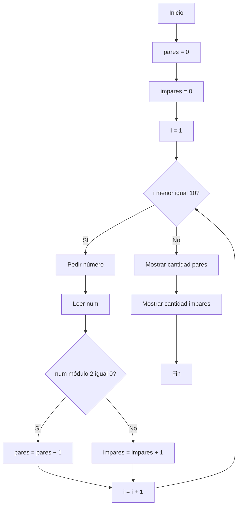
```mermaid
flowchart TD
    A[Inicio] --> B[pares = 0]
    B --> C[impares = 0]
    C --> D[i = 1]
    D --> E{i menor igual 10?}
    E -->|Sí| F[Pedir número]
    F --> G[Leer num]
    G --> H{num módulo 2 igual 0?}
    H -->|Sí| I[pares = pares + 1]
    H -->|No| J[impares = impares + 1]
    I --> K[i = i + 1]
    J --> K
    K --> E
    E -->|No| L[Mostrar cantidad pares]
    L --> M[Mostrar cantidad impares]
    M --> N[Fin]
```

---

## Ejercicio 19
**Objetivo:** Simular una calculadora que permita elegir la operación a realizar entre dos números.

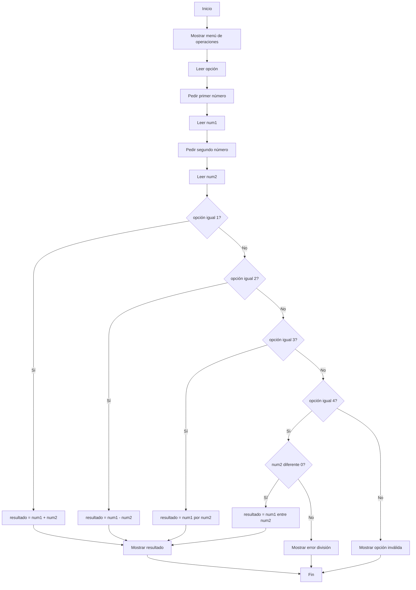
```mermaid
flowchart TD
    A[Inicio] --> B[Mostrar menú de operaciones]
    B --> C[Leer opción]
    C --> D[Pedir primer número]
    D --> E[Leer num1]
    E --> F[Pedir segundo número]
    F --> G[Leer num2]
    G --> H{opción igual 1?}
    H -->|Sí| I[resultado = num1 + num2]
    H -->|No| J{opción igual 2?}
    J -->|Sí| K[resultado = num1 - num2]
    J -->|No| L{opción igual 3?}
    L -->|Sí| M[resultado = num1 por num2]
    L -->|No| N{opción igual 4?}
    N -->|Sí| O{num2 diferente 0?}
    O -->|Sí| P[resultado = num1 entre num2]
    O -->|No| Q[Mostrar error división]
    N -->|No| R[Mostrar opción inválida]
    I --> S[Mostrar resultado]
    K --> S
    M --> S
    P --> S
    Q --> T[Fin]
    R --> T
    S --> T
```

---

## Ejercicio 20
**Objetivo:** Leer una clave y repetir el ingreso hasta que sea correcta (clave: 1234). Mostrar mensaje de bienvenida.

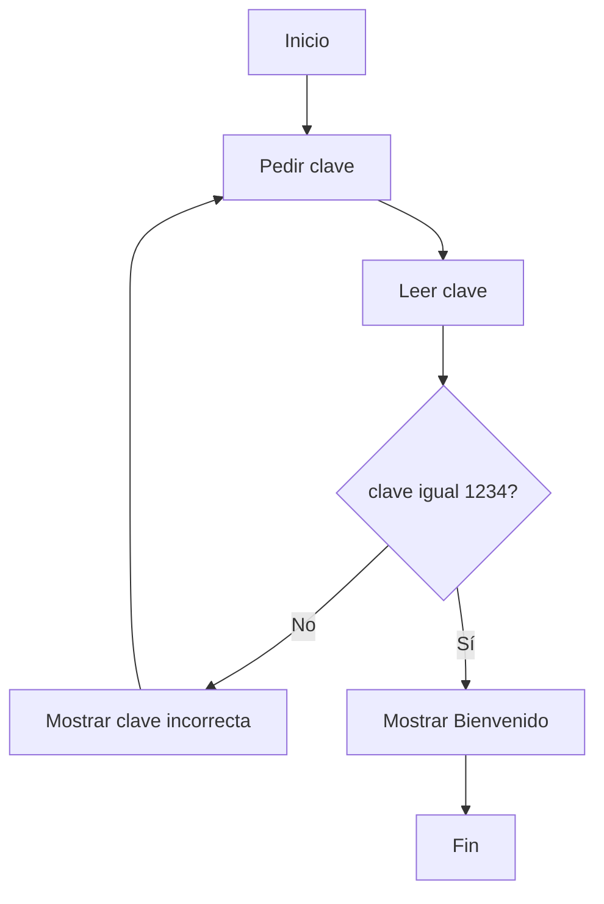
```mermaid
flowchart TD
    A[Inicio] --> B[Pedir clave]
    B --> C[Leer clave]
    C --> D{clave igual 1234?}
    D -->|No| E[Mostrar clave incorrecta]
    E --> B
    D -->|Sí| F[Mostrar Bienvenido]
    F --> G[Fin]
```

---

